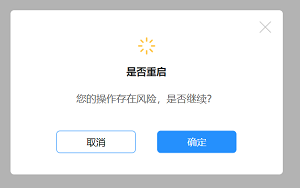
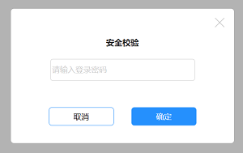
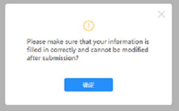
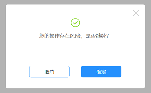

# pop-up-box
这是一个私人定制的弹出框插件，使用纯JS开发，也就是说您的项目文件只要允许导入JS文件就可以使用。

## 导入
目前，我们为小主提供两种导入方式：

第一种、通过`npm install pxu`安装插件

第二种、通过下载js插件

## 使用
```
// pxu($1, $2, $3, $4, $5)
// $1 : 表示弹出框的icon图标类型，可以不存在
// $2 : 表示弹出框的的标题，可以不存在，也可以是html字符串
// $3 : 表示弹窗的主要内容描述对象，可以为空，也可以是html字符串。
//      注意：如果html字符串中包含input，那么该标签中必须要包含id为pxu的属性，否则关闭弹出框获取不到确认数据，
//      示例：<input id="pxu" type="text" placeholder="请输入登录密码" style="..." />
// $4 : 表示弹出框的取消按钮，可以不存在
// $5 : 表示弹出框的确认按钮，必填项，默认为“确定”
 pxu('warning',                                // 可为null
    '您确认继续重启吗？',                        // 可为null
    '请确保您的信息填写正确后，提交后无法修改',     // 可为null
    '取消',                                     // 可为null
    '立即前往').then(res => {
   console.log(res)
 });
```

## 效果

基本样式：


仿prompt：


仿alert：


仿confirm：

